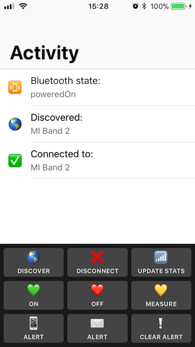
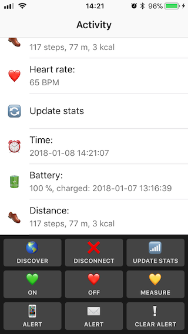

# inFullBand iOS app

## General information

App created as an example for Medium article: [*Introduction to Bluetooth LE on iOS :  Mi Band 2 case study*](https://blog.infullmobile.com/introduction-to-bluetooth-le-on-ios-mi-band-2-case-study-343153921877).
It enables some basic interaction between an iOS device and a Xiaomi Mi Band 2.

## Requirements

- Device with iOS 11.1
- Xiaomi Mi Band 2
- Xcode 10.2
- Swift 5.0

## Usage

1. Open inFullBand project in Xcode and set correct development team in in General section of project file.
2. Make sure your that:  
    a) Bluetooth is active on your iOS device,  
    b) Mi Band 2 is paired with your iOS device,  
    c) Mi Band 2 is "Discoverable" (details in aforementioned article).  
3. Run project on your iOS device
4. After brief moment you should see information "🌎 Discovered: MI Band 2" - press it to connect to your Mi Band.
5. Have fun playing with heart rate monitoring, alerts and ohter functionalities available 😉

## Screenshots

 

## License

Released under the MIT license. See the LICENSE file for more info.
